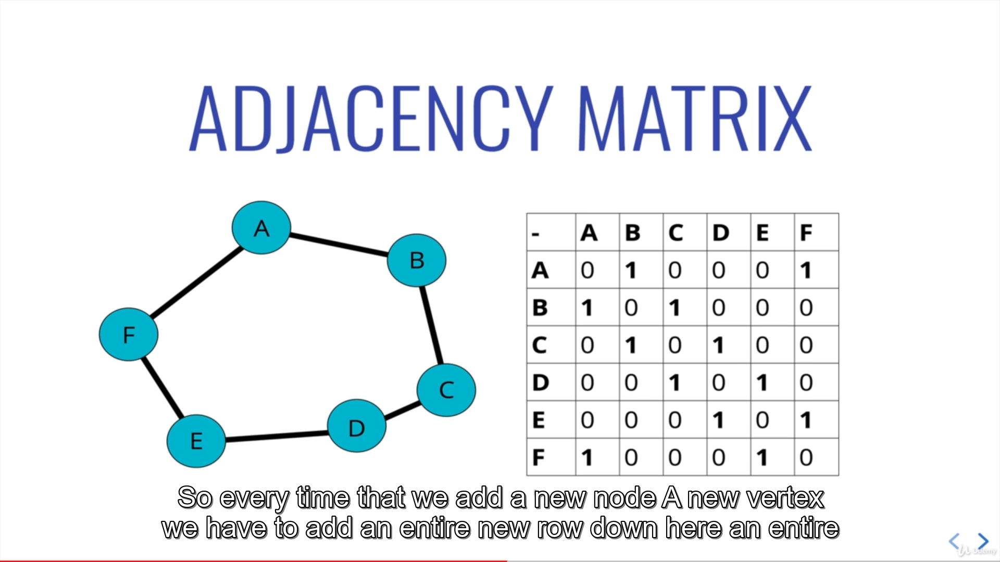
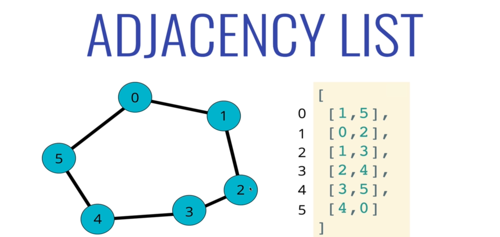
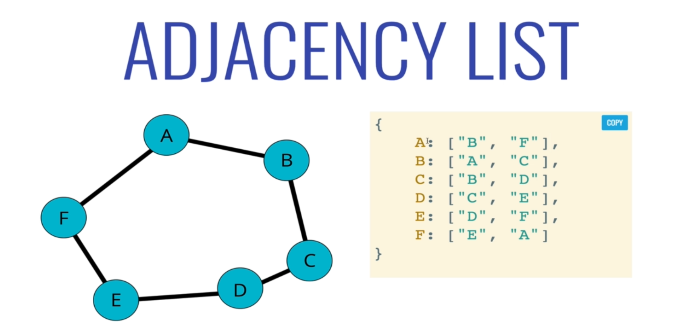
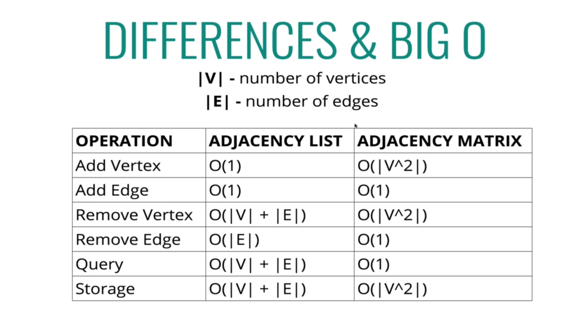
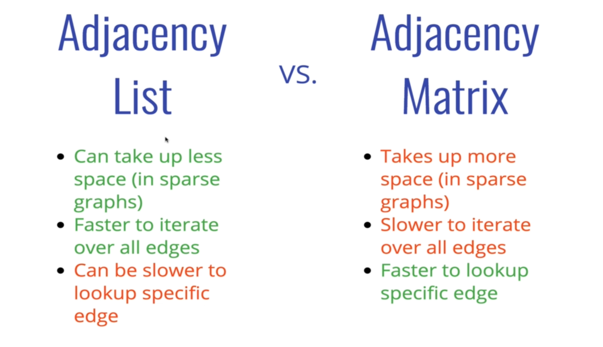

Graph:
in a graph the node is also called vertice;
the distance between nodes is the edge

Directed Graphs
Directed graphs are a class of graphs that don’t presume symmetry or reciprocity in the edges established between vertices. In a directed graph, if a and b are two vertices connected by an edge (a,b), this doesn’t necessarily mean that an edge connecting (b,a) also exists:

Definition of Undirected Graphs
Undirected graphs are more specific. For them, there’s an extra assumption regarding the reciprocity in the relationship between pairs of vertices connected by an edge. If an edge (a,b) exists between two vertices a and b, the edge (b,a) also exists:

Directed graphs have edges that are directional and not necessarily reciprocal. If a vertex in a directed graph is connected to another, that doesn’t necessarily mean that the second is also connected to the first.

Undirected graphs are more restrictive kinds of graphs. They represent only whether or not a relationship exists between two vertices. They don’t however represent a distinction between subject and object in that relationship.

     graph can store in adjacency matrix or adjacency
     for Example

Adjacency List:

we can also use hash map to store
adjacency list.

# Big O of Adjacency Matrix or List 

# Difference btw Adjacency Matrix or List

